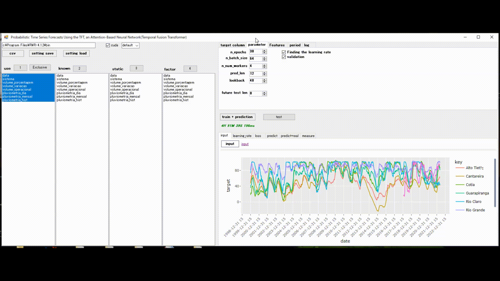

# tft

This is a C# application for time series forecasting using tft's R implementation.  
Through the C# UI, you can easily perform time series forecasting with the  
  [Temporal Fusion Transformer model](https://arxiv.org/pdf/1912.09363.pdf)  


At the core of this application, tft is  https://github.com/mlverse.  
It relies heavily on https://github.com/mlverse/tft, a wonderful library implemented in R developed at  

  

# Requirements  

[webview2](https://developer.microsoft.com/ja-jp/microsoft-edge/webview2/)  
R-4.1.2  

slider  
ggplot2  
tidymodels  
scales  
dplyr  
tidyverse  
recipes  
prodlim  
listenv  
rlang  
plotly  
htmlwidgets  

#### setup  
[tft](https://github.com/mlverse/tft)   
[torch](https://github.com/mlverse/torch )   
[luz](https://github.com/mlverse/luz)  
```
.libPaths(c('Your installation path/tft/lib',.libPaths()))
```
##### GPU(cuda11.3)  
```
Sys.setenv("CUDA_PATH"  = "C:\\Program Files\\NVIDIA GPU Computing Toolkit\\CUDA\\v11.3")
```

##### CPU
```
Sys.setenv("CUDA_PATH"  = "")
```

```
#remotes::install_github("mlverse/torch")
install.packages("torch")
```

```
install.packages("luz", repos = "http://cran.us.r-project.org")
install.packages("slider", repos = "http://cran.us.r-project.org")
install.packages("tidymodels", repos = "http://cran.us.r-project.org")
install.packages("scales", repos = "http://cran.us.r-project.org")
install.packages("dplyr", repos = "http://cran.us.r-project.org")
install.packages("tidyverse", repos = "http://cran.us.r-project.org")
install.packages("recipes", repos = "http://cran.us.r-project.org")
install.packages("prodlim" repos = "http://cran.us.r-project.org"))
install.packages("listenv" repos = "http://cran.us.r-project.org"))
install.packages("rlang", repos = "http://cran.us.r-project.org")
install.packages("gplots", repos = "http://cran.us.r-project.org")

remotes::install_github("mlverse/tft")
```

[tft](https://github.com/mlverse/tft)   
[torch](https://github.com/mlverse/torch )   
[luz](https://github.com/mlverse/luz)  
